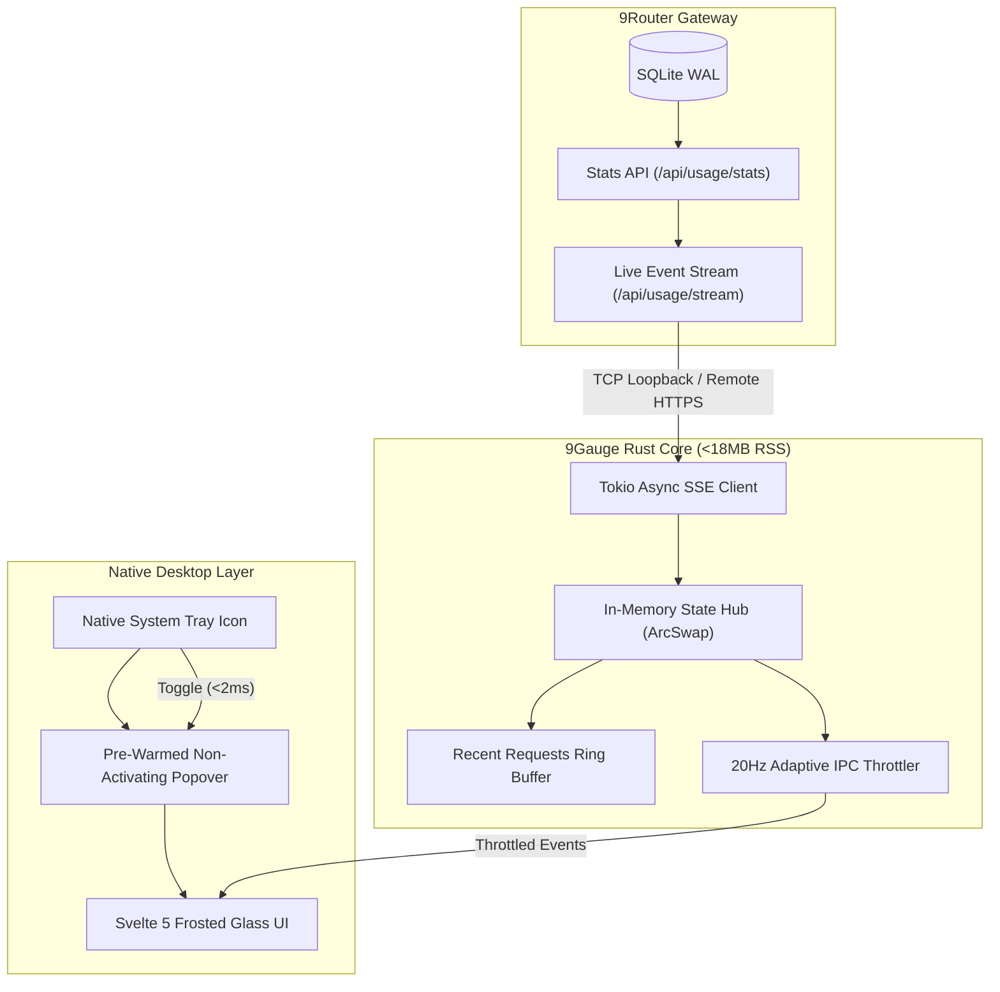

# ✦ 9Gauge

<p align="center">
  <b>A featherlight desktop HUD and system tray telemetry companion for 9Router.</b><br/>
  Tracks live token burn, prompt vs. output vs. cache ratios, and upstream quota limits at a single glance.
</p>

<p align="center">
  
  
  
  
  
</p>

---

## Overview

When running agentic AI workflows (Claude Code, Hermes Agent, Cursor) through **9Router**, developers lack ambient visibility into token expenditure, model latency, and looming rate-limit cliffs. Keeping a full browser tab open to the 9Router dashboard is noisy and consumes valuable screen real estate.

**9Gauge** provides an ambient, ultra-lightweight desktop companion inspired by the **AETER Monitor Archetype**:
- **Always-Visible Tray Strip:** Live rolling tokens, estimated cost, and status health dot (`✦ 9R · 1.2M · $0.42 ●`).
- **Instant Popover HUD (<30ms):** Zero-flicker pre-warmed flyout showing segmented token bars (Prompt, Output, Cached), provider balances, and recent request traces.
- **Battery-Centric Efficiency:** Webview background suspension and zero-copy Rust streaming that keep idle memory under 18 MB RSS with 0.0% CPU usage.

---

## Architecture

9Gauge utilizes an event-driven loopback architecture to ingest real-time telemetries without accessing the local database directly.



---

## Key Features

- **Segmented Token Visualizer:** Clear visualization of Prompt tokens, Completion tokens, and Cache Hit tokens (Anthropic Prompt Caching & Gemini Context Caching).
- **Upstream Quota Sentinel:** Live balances for OpenRouter, DeepSeek, and reset countdowns for Kiro and Codex accounts.
- **RTK Compression Badge:** Tracks tokens saved by 9Router's Request Token-Killer filters.
- **Native OS Alerts:** Alerts on sudden HTTP 429 rate limits or depleted balances.
- **Dual-Host Support:** Switch effortlessly between local `localhost:20128` and remote VPS instances.

---

## Quickstart

### Prerequisites
- [9Router](https://github.com/9router/9router) running locally or remotely.
- Rust 1.80+ and Node.js 20+ (for building from source).

### Development Setup
```bash
# Clone the repository
git clone https://github.com/Schnee111/9gauge.git
cd 9gauge

# Install dependencies
pnpm install

# Run in development mode (launches desktop tray)
pnpm tauri dev
```

---

## Design System

Crafted according to the **AETER Monitor Archetype**:
- **Frosted Glass Substrates:** 72%–80% white glass with `backdrop-filter: blur(16px)` and specular double-bezel borders.
- **Zero Number Shifting:** Strict enforcement of `JetBrains Mono` with tabular numerals (`tnum`) across all metrics.
- **Muted Inks:** Emerald `#2e9e6b` (Healthy), Amber `#d99a2b` (Warning), Rose `#d4553f` (Critical).

---

## License
MIT © Muhammad Daffa Ma'arif (Schnee) & Contributors
