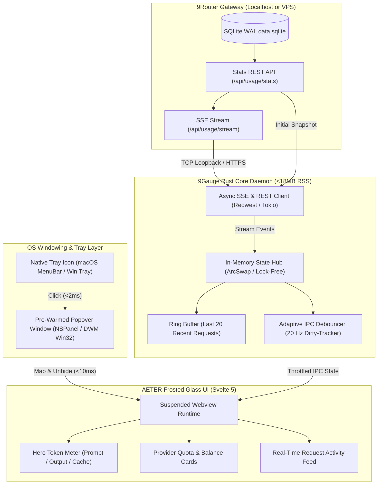

# System Architecture Document

## Project: 9Gauge (9Router Desktop HUD)
**Status:** In-Review (GATE 1)  
**Target Platforms:** macOS 13+, Windows 10/11, Linux (X11 / Wayland)  

---

## 1. High-Level System Topology

9Gauge is structured as a decoupled desktop client communicating with 9Router via a unified local/remote HTTP event stream.



---

## 2. Core Subsystems

### 2.1 Async Network Client & Telemetry Engine (Rust)
- **Runtime:** Single background Tokio thread running `reqwest-eventsource`.
- **Reconnection State Machine:**
  - `Connecting` ➔ `Healthy` ➔ `Degraded` ➔ `Disconnected` ➔ `Reconnecting`.
  - Exponential jittered backoff: `1s, 2s, 4s, 8s ... max 30s`.
  - Heartbeat watchdog: If no `: ping` or event arrives within 35 seconds, drops socket and reconnects.
- **Payload Demuxing:**
  - Light `pending` messages: Updates only active request counts and in-flight indicators.
  - Complete `stats` messages: Updates historical aggregates, token breakdowns, and provider costs.

### 2.2 In-Memory State Pipeline & Zero-Allocation Ring Buffer
- **Storage:** `ArcSwap<AppState>` for lock-free, atomic reads from the UI thread without lock contention.
- **Fixed-Capacity Ring Buffer:** `RecentRequestsRingBuffer<20>`:
  - Uses fixed memory slots with inline strings (`CompactStr`) to prevent heap reallocations during request bursts.
- **Adaptive IPC Throttling:**
  - Caps Webview event dispatching at **20 Hz (50ms debouncing)** with dirty-flag detection.
  - Prevents IPC bus flooding when parallel coding agents burst 20+ tool calls simultaneously.

### 2.3 Window Lifecycle & Non-Activating Popover Mechanics
- **Zero-Flicker Pre-Warming:**
  - The Webview window is created at boot with `visible: false` and pre-rendered in GPU memory.
  - Coordinate calculation occurs *before* unhiding, eliminating default (0,0) jump artifacts.
- **macOS (`NSPanel`):**
  - Configured with `.nonactivatingPanel` and `canBecomeKeyWindow = NO` so clicking the tray popover does not steal keyboard focus from Cursor, VSCode, or terminal.
- **Windows (Win32):**
  - Utilizes `Shell_NotifyIcon` coordinates and `GetCursorPos` with clamping to prevent offscreen rendering on multi-monitor setups.
- **Auto-Blur Dismissal:**
  - Listens to `WindowEvent::Focused(false)` to immediately call `window.hide()`.

### 2.4 Suspended Webview Governance (Power & Battery Preservation)
- When the popover is hidden:
  - Windows: Invokes `ICoreWebView2_3::TrySuspend` / Low memory target to drop background CPU/GPU to 0.0%.
  - macOS: Halts animation frames and decouples WebKit alpha compositing, dropping idle background power draw from ~620 mW to < 50 mW.

---

## 3. Data Contracts & Serialization

### Ingested Snapshot Schema (`GET /api/usage/stats?period=today`)
```json
{
  "totalPromptTokens": 890400,
  "totalCompletionTokens": 148120,
  "totalCachedTokens": 210000,
  "totalCost": 0.428,
  "byProvider": {
    "openrouter": {
      "requests": 42,
      "promptTokens": 284100,
      "completionTokens": 32000,
      "cachedTokens": 54000,
      "cost": 0.382
    },
    "deepseek": {
      "requests": 14,
      "promptTokens": 36000,
      "completionTokens": 8200,
      "cachedTokens": 0,
      "cost": 0.046
    }
  },
  "activeRequests": [
    {
      "model": "gpt-5.3-codex",
      "provider": "codex",
      "count": 1
    }
  ],
  "recentRequests": [
    {
      "timestamp": "2026-09-22T02:34:10.123Z",
      "model": "claude-sonnet-4-6",
      "provider": "openrouter",
      "promptTokens": 4200,
      "completionTokens": 340,
      "cachedTokens": 1800,
      "status": "ok"
    }
  ],
  "errorProvider": ""
}
```
