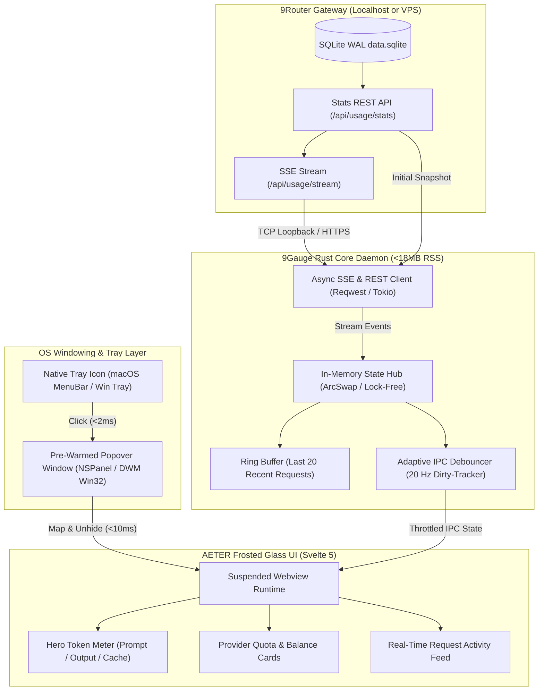

# System Architecture Document

## Project: 9Gauge (9Router Desktop HUD)
**Status:** In-Review (GATE 1 — revised after live audit 2026-09-22)  
**Target Platforms:** macOS 13+, Windows 10/11, Linux (X11 / Wayland)  

---

## 0. Crate Topology (Revised — Headless Core Split)

Karena VPS/CI environment umumnya headless (tanpa `webkit2gtk`/`pkg-config`), seluruh logic inti di-decouple dari shell Tauri agar tetap bisa di-build dan di-test (`cargo test`) tanpa dependensi GUI:

```
9gauge/
├── crates/
│   └── gauge-core/        # Pure Rust, headless, 100% unit-testable di VPS/CI
│       ├── telemetry/      # SSE + REST client, auth strategies, reconnect FSM
│       ├── models.rs       # Fail-open serde contracts (#[serde(default)])
│       └── state.rs        # ArcSwap<AppState>, ring buffer
├── src-tauri/              # Thin shell: tray, window lifecycle, IPC bridge (butuh GUI deps)
├── src/                    # Svelte 5 frontend (AETER frosted glass)
└── Cargo.toml              # [workspace] members = ["crates/*", "src-tauri"]
```

Aturan: `src-tauri` dilarang berisi logic telemetri; ia hanya mengonsumsi `gauge-core`.

---

## 1. High-Level System Topology

9Gauge is structured as a decoupled desktop client communicating with 9Router via a unified local/remote HTTP event stream.



---

## 2. Core Subsystems

### 2.1 Async Network Client & Telemetry Engine (Rust)
- **Runtime:** Single background Tokio thread running `reqwest-eventsource`.
- **Reconnection State Machine:**
  - `Connecting` ➔ `Healthy` ➔ `Degraded` ➔ `Disconnected` ➔ `Reconnecting`.
  - Exponential jittered backoff: `1s, 2s, 4s, 8s ... max 30s`.
  - Heartbeat watchdog: If no `: ping` or event arrives within 35 seconds, drops socket and reconnects.
- **Payload Demuxing:**
  - Light `pending` messages: Updates only active request counts and in-flight indicators.
  - Complete `stats` messages: Updates historical aggregates, token breakdowns, and provider costs.

### 2.2 In-Memory State Pipeline & Zero-Allocation Ring Buffer
- **Storage:** `ArcSwap<AppState>` for lock-free, atomic reads from the UI thread without lock contention.
- **Fixed-Capacity Ring Buffer:** `RecentRequestsRingBuffer<20>`:
  - Uses fixed memory slots with inline strings (`CompactStr`) to prevent heap reallocations during request bursts.
- **IPC Throttling (Revised — audit):** Debouncer 20Hz **dihapus** — 9Router sudah membatasi laju event sendiri via `scheduleStatsEvent` (throttle 150–250ms ≈ 4–6 event/s, sisi server, di `usageRepo.js`). Klien cukup melakukan atomic swap per event; Svelte 5 reactivity menangani render. Dirty-flag tracker dihapus dari core.

### 2.3 Window Lifecycle & Non-Activating Popover Mechanics
- **Zero-Flicker Pre-Warming:**
  - The Webview window is created at boot with `visible: false` and pre-rendered in GPU memory.
  - Coordinate calculation occurs *before* unhiding, eliminating default (0,0) jump artifacts.
- **macOS (`NSPanel`):**
  - Configured with `.nonactivatingPanel` and `canBecomeKeyWindow = NO` so clicking the tray popover does not steal keyboard focus from Cursor, VSCode, or terminal.
  - **Dismissal koreksi (audit):** Panel non-activating tidak pernah menjadi key window, sehingga `WindowEvent::Focused(false)` **tidak akan terpicu**. Dismissal memakai global `NSEvent` mouse-down monitor: klik di luar bounds popover → `window.hide()`. `Focused(false)` dipertahankan sebagai fallback untuk jalur aktivasi terkontrol.
- **Windows (Win32):**
  - Utilizes `Shell_NotifyIcon` coordinates and `GetCursorPos` with clamping to prevent offscreen rendering on multi-monitor setups.
  - `WindowEvent::Focused(false)` tetap valid di sini (popover menerima fokus) → auto-hide.
- **Auto-Blur Dismissal (Linux):** `Focused(false)` pada popover yang difokuskan saat dibuka.

### 2.4 Tray UX Per-Platform (Revised — Text Rendering Reality)
- **macOS:** `NSStatusItem` mendukung teks native → dynamic title `✦ 9R · 1.2M · $0.42 ●` dirender penuh.
- **Windows / Linux:** `Shell_NotifyIcon` / AppIndicator **hanya mendukung ikon bitmap** — dilarang mengandalkan tray text. Strategi:
  - Ikon status dot dinamis (Emerald / Amber / Rose / Slate) di-render ke bitmap 32×32 (dengan angka ringkas saat perf memungkinkan).
  - Tooltip mengikuti teks lengkap (`9Gauge: 1.2M tok · $0.42`).
  - Angka burn tetap terlihat via popover, bukan tray.

### 2.5 Suspended Webview Governance (Power & Battery Preservation)
- **MVP (revised):** `window.hide()` + sinyal IPC ke Svelte 5 untuk menghentikan `requestAnimationFrame`/CSS animation/interval → daya idle turun signifikan tanpa kode unsafe COM.
- **P1/P2 (deferred):** Deep suspension via OS API:
  - Windows: Invokes `ICoreWebView2_3::TrySuspend` / Low memory target to drop background CPU/GPU to 0.0%.
  - macOS: Halts animation frames and decouples WebKit alpha compositing, dropping idle background power draw from ~620 mW to < 50 mW.

---

## 3. Data Contracts & Serialization

### Empirically Verified Live Payload (2026-09-22, `GET /api/usage/stats?period=today`)
Kontrak di bawah TERVERIFIKASI terhadap payload produksi. Field tambahan di luar draft awal:
- `last10Minutes[]` — bucket throughput per menit (`requests`, `promptTokens`, `completionTokens`, `cost`) → bahan burn-rate tanpa perhitungan klien.
- `pending.byModel` / `pending.byAccount` — permintaan in-flight.
- `byApiKey` (key masked `sk-***`), `byEndpoint` — agregasi silang.
- **Provider names are DYNAMIC keys** (`antigravity`, `qoder`, `openai-compatible-chat-<uuid>`, ...) — UI dilarang hardcode.

### Ingested Snapshot Schema (`GET /api/usage/stats?period=today`)
```json
{
  "totalPromptTokens": 890400,
  "totalCompletionTokens": 148120,
  "totalCachedTokens": 210000,
  "totalCost": 0.428,
  "byProvider": {
    "openrouter": {
      "requests": 42,
      "promptTokens": 284100,
      "completionTokens": 32000,
      "cachedTokens": 54000,
      "cost": 0.382
    },
    "deepseek": {
      "requests": 14,
      "promptTokens": 36000,
      "completionTokens": 8200,
      "cachedTokens": 0,
      "cost": 0.046
    }
  },
  "activeRequests": [
    {
      "model": "gpt-5.3-codex",
      "provider": "codex",
      "count": 1
    }
  ],
  "recentRequests": [
    {
      "timestamp": "2026-09-22T02:34:10.123Z",
      "model": "claude-sonnet-4-6",
      "provider": "openrouter",
      "promptTokens": 4200,
      "completionTokens": 340,
      "cachedTokens": 1800,
      "status": "ok"
    }
  ],
  "errorProvider": ""
}
```
